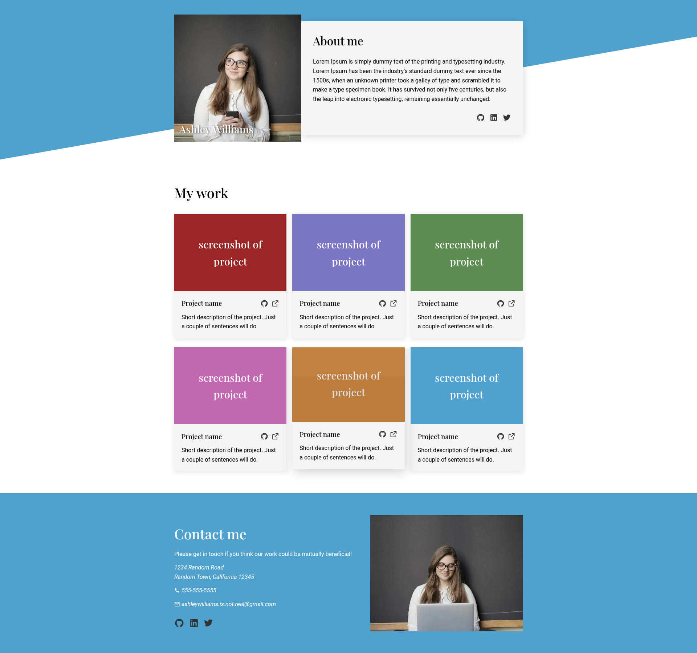

# Homepage — The Odin Project

A responsive portfolio homepage built as part of [The Odin Project](https://www.theodinproject.com/lessons/node-path-advanced-html-and-css-homepage) Advanced HTML & CSS curriculum.

## 🔗 Live Demo

**[jormaedes.github.io/homepage](https://jormaedes.github.io/homepage/)**

---

## Preview



---

## Features

- **Animated hero section** — profile photo and about card slide in on page load
- **Scroll-triggered reveals** — section titles and footer fade in as the user scrolls
- **Staggered project cards** — each card enters with a cascading delay for a polished feel
- **Hover micro-interactions** — cards lift on hover; social and project links animate upward
- **Fully responsive** — adapts gracefully across desktop (3-column grid), tablet (2-column) and mobile (single column)

## Built With

- HTML5
- CSS3 (custom properties, CSS Grid, Flexbox, keyframe animations)
- Vanilla JavaScript (IntersectionObserver API)
- [Remix Icon](https://remixicon.com/) for icons
- [Google Fonts](https://fonts.google.com/) — Playfair Display + Roboto

## Getting Started

```bash
git clone https://github.com/jormaedes/homepage.git
cd homepage
# Open index.html in your browser — no build step required
```

## Project Structure

```
homepage/
├── imgs/
|   └──── preview.png
├── index.html
├── style.css
└── scroll-animations.js
```

## What I Learned

- Combining CSS `@keyframes` with `IntersectionObserver` for performant scroll animations
- Using `skewY` on a pseudo-element to create a diagonal hero background without distorting content
- Structuring responsive breakpoints with a mobile-first mindset using CSS Grid's `repeat(auto-fit, minmax())` as a starting point, then tightening column counts at specific breakpoints

---

## Acknowledgements

- [The Odin Project](https://www.theodinproject.com/) for the curriculum and project spec
- Photos from [Pexels](https://www.pexels.com/)